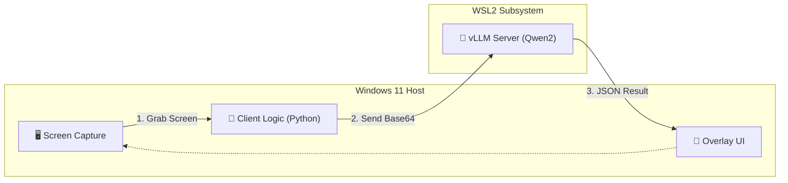

# 2Mind
This is OS-Copilot and/or Context-Aware Assistant built for ourselves by our own PC/Laptops (mobile phone coming soon...)

## Github Project Structure

#### 2mind/
##### ├── .github/                # GitHub Actions 
##### ├── assets/                 # architecture diagram, Demo pictures used by readme.md
##### ├── client-windows/         # Windows client source codes
##### │   ├── src/
##### │   │   ├── observer.py     # capture screen
##### │   │   ├── overlay.py      # UI display (PyQt/Tkinter)
##### │   │   └── utils.py        # Picture utilities
##### │   ├── requirements.txt    # mss, openai, pillow, etc.
##### │   └── config.yaml         # configuration for VLM and applications.
##### ├── server-vllm/            # Linux/WSL configuration
##### │   ├── start_server.sh     # vLLM script
##### │   ├── models/             # (optional) additional adapter
##### │   └── requirements.txt    # vllm, flash-attn
##### ├── docs/                   # design documents
##### ├── .gitignore              # 
##### ├── README.md               # Entry of this project
##### └── LICENSE                 # MIT License

## 🏗 Architecture

## How to Run
### Step 1 - KYE (Know Your Environment)
Here is my testing environment:
* Windows 11 Pro (MEM 64GB/GPU 24GB)
* Pycharm 
* Minconda Python 3.13
* WSL2 (Ubuntu 22.04)
* CUDA 12.x